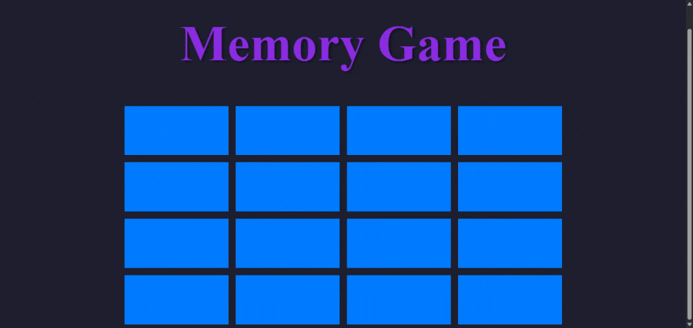

# 🚀 Vanilla JS Projects

Welcome to my showcase of major **Vanilla JavaScript Projects** — built from the ground up using only **HTML**, **CSS**, and **JavaScript (ES6+)**. No frameworks, no shortcuts. Just clean, structured, responsive, and interactive web applications.

Each project focuses on essential frontend concepts like DOM manipulation, game logic, UI/UX dynamics, and real-time feedback — all delivered through intuitive and visually appealing interfaces.

## 🧠 1. Memory Game – Flip & Match



A 4x4 card-matching game that challenges the player’s memory with randomized symbol pairs, flip logic, and automated win detection.

**✨ Features:**
- 🔀 Real-time symbol shuffling on every game start using Fisher–Yates Shuffle Algorithm.
- 🧠 Match detection using `data-symbol` attributes.
- 🎯 Flip-back animation for mismatches with delay logic.
- 🏆 “YOU WIN” state display + auto-restart system.
- 🚀 Self-contained logic loop for continuous play.

**🛠️ Tech Stack:** HTML, CSS , JavaScript
<a href="https://flip-and-match-seven.vercel.app/" target="_blank">🔗 Live Demo</a>

## 🖼️ 2. Image Carousel


A responsive and seamless image slider that cycles through a gallery of high-resolution images with elegant transitions and button controls.

**✨ Features:**
- 🔁 Infinite looping with modular indexing logic.
- 🎯 Responsive layout powered by Flexbox.
- 🖱️ Interactive Prev/Next controls with smooth animations.
- ⚡ `translateX`-based slide transitions.
- 💡 Fully modular JS logic for reusability.

**🛠️ Tech Stack:** HTML, CSS , JavaScript
<a href="https://image-carousel-lake.vercel.app/" target="_blank">🔗 Live Demo</a>


## ✨ 3. Random Quote Generator


An animated, API-powered quote generator that fetches and displays a fresh quote along with a tag — all with stylish transitions.

**✨ Features:**
- 🌐 Live API integration (`go-quote.azurewebsites.net`)
- 💬 Fade-in effects on quote + tag reveal.
- 🔃 First quote automatically fetched.
- 🆕 One-click new quote with animated update.
- ⚠️ Error handling with graceful fallback UI.
- 🧩 Automatic tagging or default to `#wisdom`.

**🛠️ Tech Stack:** HTML , CSS , JavaScript


## ❌⭕ 4. Tic Tac Toe (2-Player)


A classic two-player Tic Tac Toe game featuring real-time win logic, dynamic turn display, and restart functionality.

**✨ Features:**
- 👥 Live alternating turns with turn tracker.
- 🧠 Win detection across rows, columns, diagonals.
- 🔒 Board disables after a win or draw.
- ♻️ Restart button resets game state instantly.
- 🎨 Polished layout using CSS Grid + Flexbox.

**🛠️ Tech Stack:** HTML, CSS, JavaScript
<a href="https://tic-tac-toe-two-mocha-15.vercel.app/" target="_blank">🔗 Live Demo</a>


## 📂 Project Structure


```

VANILLA_JS_PROJECTS/
├── FLIP AND MATCH/
│   ├── index.html
│   ├── script.js
│   └── styles.css
│
├── GIFs/
│   ├── FLIP-AND-MATCH.gif
│   ├── IMAGE-CAROUSEL.gif
│   ├── QUOTE-GENERATOR.gif
│   └── TIC-TAC-TOE.gif
│
├── IMAGE CAROUSEL/
│   ├── index.html
│   ├── script.js
│   └── styles.css
│
├── QUOTE GENERATOR/
│   ├── index.html
│   ├── script.js
│   └── styles.css
│
└── TIC-TAC-TOE/
    ├── index.html
    ├── script.js
    └── styles.css


```

## 🚀 How to Run Locally

1. Clone the repo:
   ```bash
   git clone https://github.com/ParthAhuja4/VANILLA_JS_PROJECTS.git
   cd VANILLA_JS_PROJECTS
2.  Open any project folder:
    
    ```bash
    cd FLIP AND MATCH
    ```
    
3.  Launch `index.html` in your browser.
    

> ⚡ No builds, no installs. Just open and run.
## 🧠 What This Demonstrates

-   ✅ DOM manipulation and event-driven interactions
    
-   ✅ API integration and error handling
    
-   ✅ Game logic with conditional flow
    
-   ✅ CSS transitions, animations, and responsiveness
    
-   ✅ Scalable, readable JavaScript structure
## 📬 Contact

**Developer:** Parth Ahuja  
**GitHub:** https://github.com/ParthAhuja4
**Email:** parthahuja006@gmail.com
